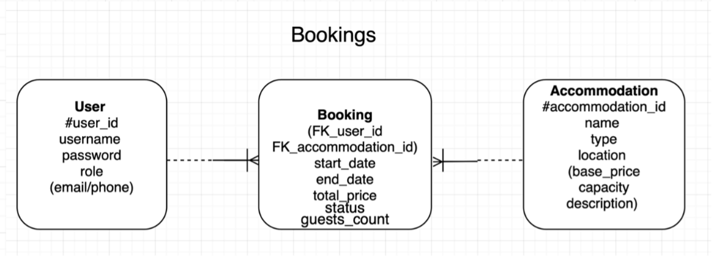
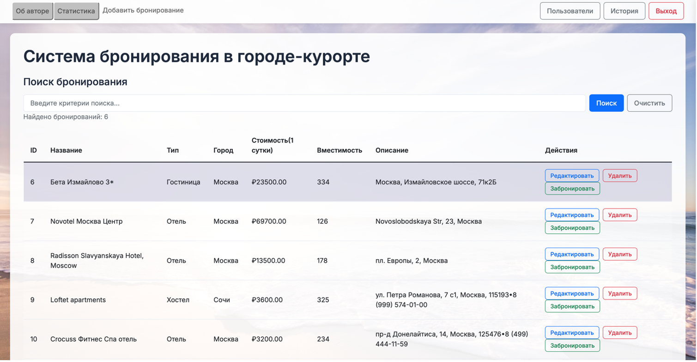
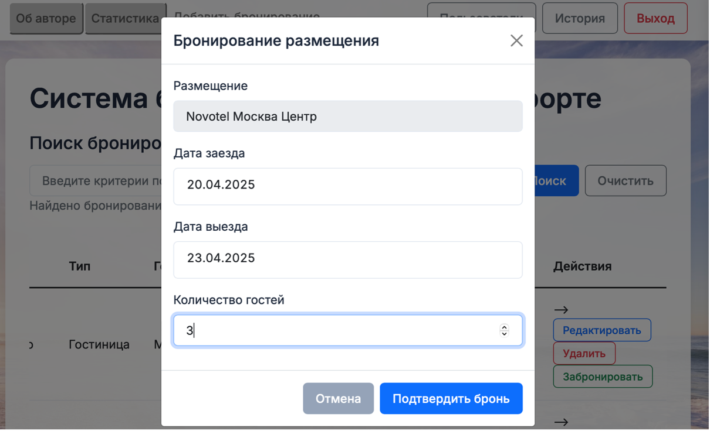
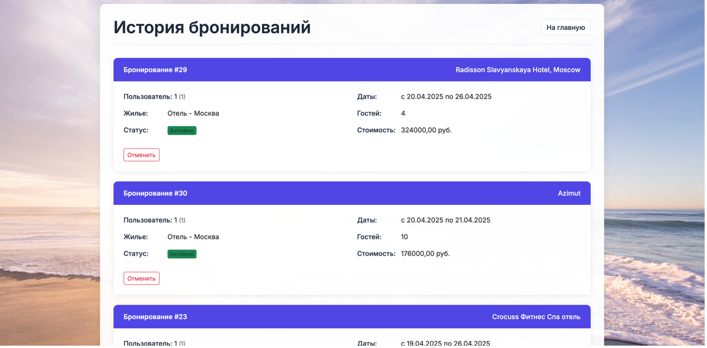
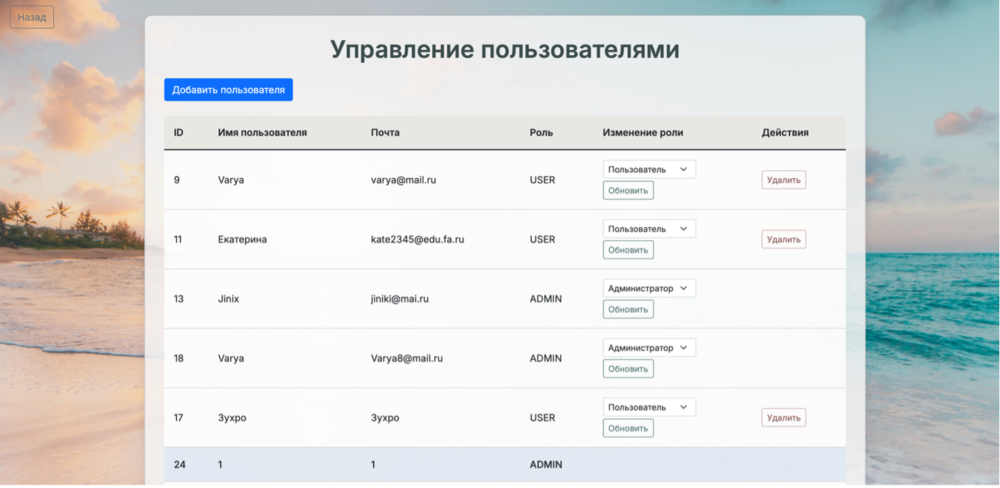
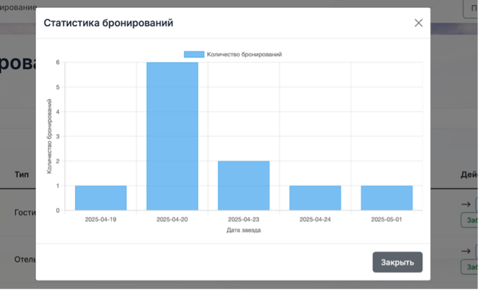
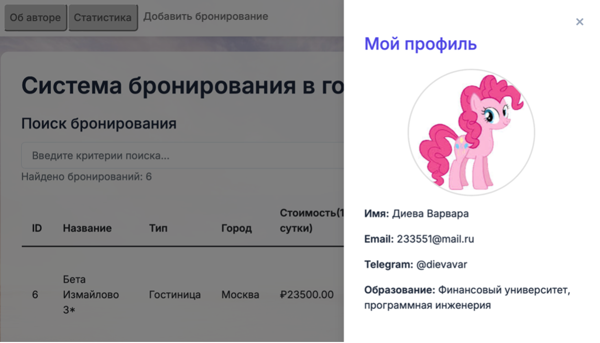

# Информационно-справочная система бронирования мест в городе-курорте

## 📌 Описание проекта
Данный проект представляет собой веб-приложение, реализующее **информационно-справочную систему (ИСС)** для бронирования мест в курортном городе.  
Система автоматизирует управление пользователями и их бронированиями, позволяя туристам быстро находить и бронировать места, а администраторам – управлять размещениями, контролировать пользователей и анализировать статистику.

Разработано в рамках курсовой работы по дисциплине *«Современные технологии программирования»*.

---

## 🎯 Цели и задачи
- Автоматизация процессов бронирования в курортных городах.
- Обеспечение удобного интерфейса для туристов и администраторов.
- Повышение качества обслуживания клиентов за счёт современных технологий.
- Реализация безопасной архитектуры с разделением ролей (USER / ADMIN).
- Хранение и управление данными о бронированиях в реляционной БД PostgreSQL.

---

## 🛠 Используемые технологии
- **Java 17+**
- **Spring Boot** (Spring MVC, Spring Data JPA, Spring Security)
- **PostgreSQL**
- **Thymeleaf**
- **HTML, CSS, JavaScript**
- **Maven/Gradle**
- **REST API**
- **BCrypt**

---

## 🧩 Архитектура проекта
Приложение построено по принципу **клиент-серверной архитектуры** с использованием **MVC** и **REST API**.

### Структура пакетов:
```
src/main/java/com/example/project
│── config/         # Конфигурации (Spring, безопасность, MVC)
│── controller/     # Контроллеры (обработка запросов)
│── domain/         # Модели (сущности базы данных)
│── repos/          # Репозитории (Spring Data JPA)
│── services/       # Бизнес-логика
```

---

## 🗄️ База данных

### ER-диаграмма


---

## 👥 Роли пользователей
- **Гость (неавторизованный)** – просмотр объектов, регистрация, вход.  
- **Турист (USER)** – создание/просмотр бронирований, личный кабинет.  
- **Администратор (ADMIN)** – управление пользователями, размещениями, бронированиями и статистикой.  

---

## ⚙️ Функционал

### Для туристов:
- Регистрация и авторизация.
- Просмотр доступных размещений.
- Поиск и фильтрация.
- Создание бронирования.
- Просмотр и отмена своих бронирований.

### Для администратора:
- Управление пользователями и ролями.
- Добавление/редактирование объектов размещения.
- Просмотр и восстановление бронирований.
- Статистика загрузки.
- Доступ к панели администрирования.

---

## 🔒 Безопасность
- Spring Security + BCrypt.
- CSRF защита.
- Разграничение ролей (ROLE_USER / ROLE_ADMIN).
- Ограничение доступа к маршрутам.

---

## 🚀 Установка и запуск

### Требования:
- Java 17+
- PostgreSQL 15+
- Maven или Gradle

### Инструкция:
```bash
# 1. Клонирование
git clone https://github.com/dievavar/bookings_curs.git

# 2. Создание базы
psql -U postgres -c "CREATE DATABASE bookings_curs;"

# 3. Настройка application.properties
spring.datasource.url=jdbc:postgresql://localhost:5432/bookings_curs
spring.datasource.username=your_username
spring.datasource.password=your_password
spring.jpa.hibernate.ddl-auto=update

# 4. Запуск
mvn spring-boot:run
```

После запуска проект доступен по адресу:  
👉 `http://localhost:8080`

---

## 📊 Интерфейс (скриншоты)

### Главная страница


### Модальное окно бронирования


### История бронирований


### Панель управления пользователями (ADMIN)


### Статистика


### Страница об авторе


---

## 📈 Перспективы развития
- Добавление отзывов и рейтингов.
- Интеграция онлайн-оплаты.
- Дополнительные услуги (SPA, экскурсии).
- Расширенная аналитика бронирований.

---

## 👩‍💻 Автор
**Диева В.В.**  
Студентка группы ТРПО23-2, Финуниверситет  
Контакты указаны на странице "Об авторе".

---

## 📎 Репозиторий
🔗 [GitHub – bookings_curs](https://github.com/dievavar/bookings_curs)
